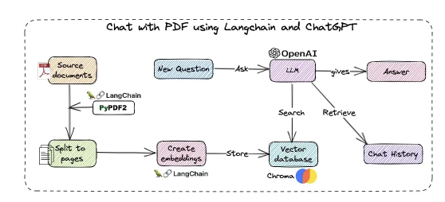

# How to Run

1. Generate an api key from Gemini.
2. Create a file whose name is "MyApiKey.txt". Put your key in it.
3. Run Gemini_Base.py

## Add some simple demo reply on langchain.

The demos are from the sharing from https://github.com/XingYu-Zhong/LangChainStudy/tree/master 
Thanks for sharing

## How vector store works
About how vector store works, can see https://medium.com/@AndresHerranz/llms-langchain-and-vectorstores-2489a2ea1ef1

## About how retrival works
step1: The goal of this function is to generate a dictionary with two keys: context and question, used to pass the context to the prompt template.
The 'context' is generated by retriever with the message passed by 'important_criteria context'. Retriever will get from the trucks and embedings and calulate the final context and set it as 'context' property.

step2: Pass the dictionary generated in the first step to the prompt template for prompt template formatting

step3: Pass the formatted prompt of the prompt template to the model (model)

step4: Pass the model call results to the output parser StrOutputParser

## The difference between LangChain Agent and Chain

https://brightinventions.pl/blog/introducing-langchain-agents-tutorial-with-example/#:~:text=What%20is%20LangChain%20agent%3F,take%20to%20get%20a%20result.

LangChain Agent vs. Chain

Besides having agents, LangChain also supports the idea of a Chain.

Chain is a subsequence of actions to take, always in a hardcoded manner. This is the crucial difference between an agent and a chain. While in the agent, the reasoning model may choose other actions (from given tools) to fetch specific data, the chain will always take the same path that we have chosen.

Advantages of agents compared to chains:

Based on the description of tools, the agent decides which tool should be used to get relevant information.
Agent takes actions and takes the context of the given result to e.g. search for other information in other resources (like for example Google Search and Wikipedia).
The agent checks the results and repeats the process to get the desired data.